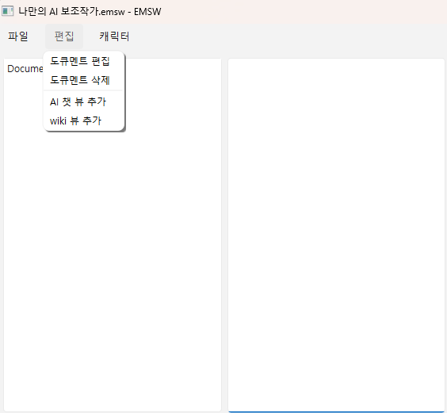
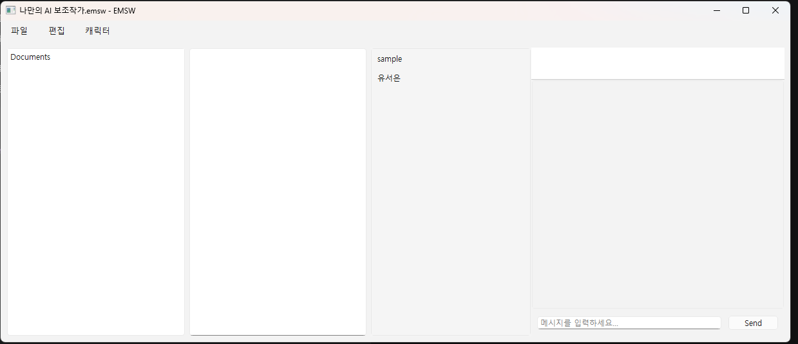
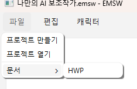
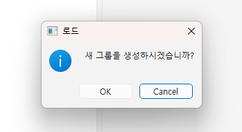
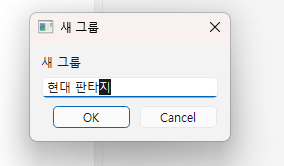
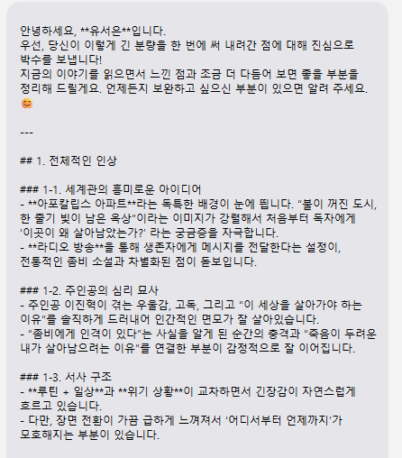
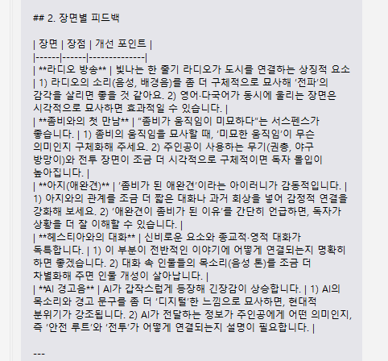
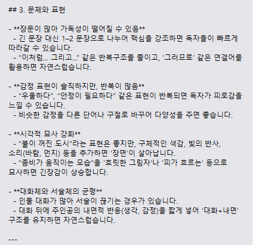
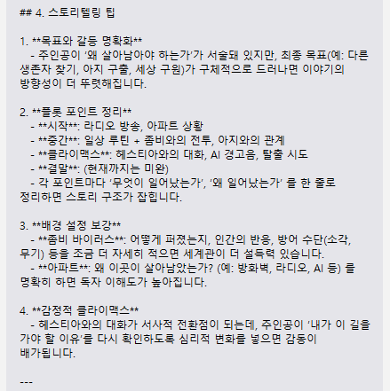
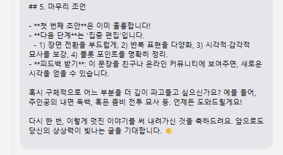

<h3>시작 전 고지</h3> 
<h4>본 프로젝트는 아직 완성되지 않은 프로젝트입니다.</h4> 
현 프로젝트에서 편집할 수 있는 부분은 매우 적은 내용만 가능하며, 주기적으로 업데이트 할 예정입니다. 
부족한 기능은 차후 계속 업로드 됩니다. 
 
 
 
 
 
 
 
우선, 처음에는 AI와 대화할 수 있는 기능이 꺼져있습니다. 
아직 활성화되지는 않으며, 편집을 통해 AI 뷰를 추가할 수 있습니다. 
(wiki 뷰 추가는 구현되지 않았습니다.) 
 
 
 
 
 
 
 
 
 
 
이제 문서를 여는 방법과 편집을 위한 방법입니다. 
 
 
 
 
 
 
 
 
아직 hwp 파일밖에 구현되지 않았으며, 이것 조차도 hwp_helper를 활용하여 구현했습니다. 
 
[hwp_helper](https://libraries.io/pypi/helper-hwp)
 
문서를 불러오면 '새 그룹 생성'을 물어봅니다. 
새 그룹은 문서의 그룹을 만들며, '분류'를 위한 기본 기능입니다. 
 
 

 
 
그룹이 있는 경우 cancel을 누르면 새로 만들어지지만, 현재는 없으므로 생성을 선택합니다. 
 
 
 
 
 
 
 
해당 소설은 '본 개발자'가 저작권을 가지고 있는 '습작'수준의 글 입니다. 
아마 공개할 생각이 없으므로, 저작권에는 자유롭지만 구태여 공개하지는 않습니다. 
 
 
 
디폴트는 편집되지 않습니다. 
또한, 아직 완성 전의 편집뷰이므로 기능의 제한이 많습니다. 
 
 
여기서, 가볍게 문서의 내용이 어떤지 봅시다. 
아직 디버그 단계이므로, 문서의 내용은 실행한 CMD에 그대로 노출됩니다. 
 
 
너무 길어서 대답 내용도 짤라야 겠네요. 
 
 
 
 
 
 
 
 
 
 
 
 
 
 
 
여기까지가 기본 사용법입니다. 
 
 
 
그 외에는, 편집에서 도큐멘트 편집을 눌러 도큐멘트의 편집 기능을 켜고 끌 수 있으며, 삭제 기능으로 도큐멘트를 삭제할 수 있습니다. 
 
현재 단계에서 사용성이 뛰어난 프로그램은 결코 아니지만, LLM 모델의 성능을 테스트하고 개선하며, 전문가가 아닌 사용자에게 충분한 프롬프팅을 체험해 볼 수 있다는 점에서 재미있는 프로젝트라고 전 생각합니다. 
 
 
 
 
<h1>__Thank you See My Portfolio__</h1> 
 
 
 
