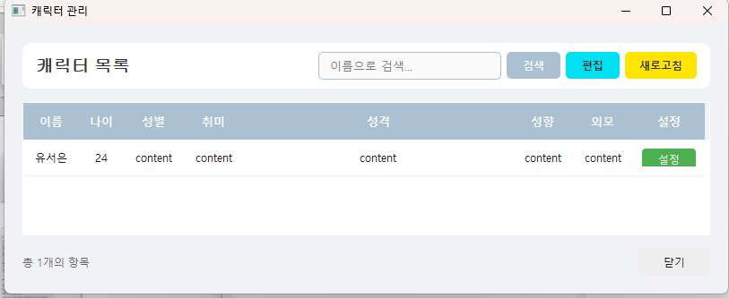
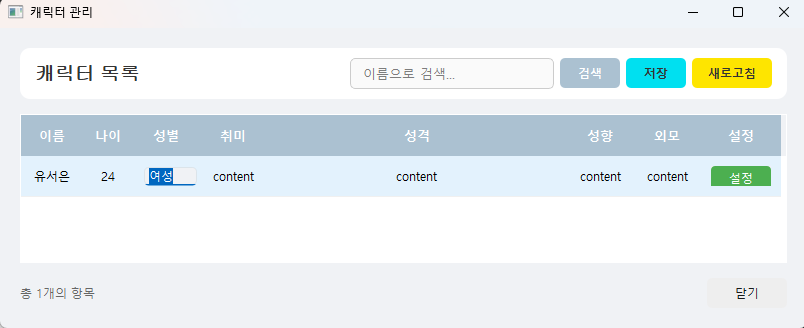
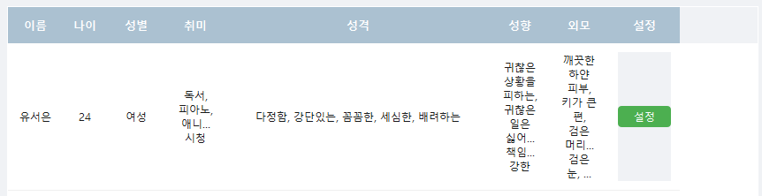
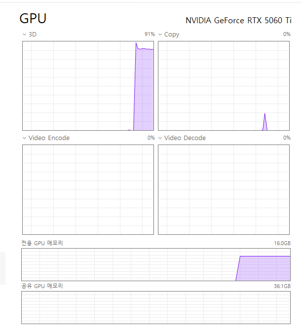

 
 
<h2>실수로 완료되기 전에 꺼서, 다시 생성하면서 다른 방법을 설명하겠습니다.</h2> 
 
 
우선, 이름과 나이만 설정하고 취소를 눌러주세요.
 
 
 
 
 
 
이런 모습의 창이 보입니다. 
여기서 편집 버튼을 누르면, 편집할 수 있게 바뀌는데 딱 한번만 클릭해 줍시다.  
 
 
그러면 해당 셀이 편집모드로 변하기 때문에 입력할 수 있습니다. 
 
 
 
 
 

 
 
모두 입력이 끝났다면, 저장 버튼을 눌러서 설정을 저장해 줍시다. 
 
 
 
그리고 새로고침을 눌러주면, 문장이 정리되어 보기 편하게 정돈됩니다. 
 
 
 
 
 
 
그러면 다시 [__여기__](./HowToUse_AIEditting.md)로 넘어가서 편집을 마저 해주도록 합시다. 
 
 
 
 