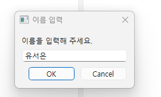
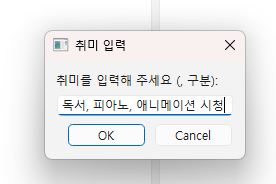
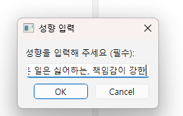
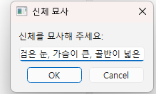
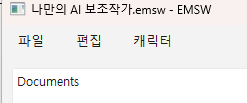

<h1>EMSW(Echo Mind Sub Writer)</h1>

<h2>프로잭트 개요</h2>

이 프로젝트는 문서 작업을 지원하기 위하여 Local AI를 다루는 방법을 체계적으로 보완한 프로젝트로서, 다음과 같은 역할을 한다.

<h3>창작자 또는 기획자 등의 저작권자</h3>

IP를 가지고 개발하는 저작자들에게는 가장 중요한 것이 바로 이 저작물을 AI가 외부에서 학습하느냐 하지 않느냐에 대한 중요한 문제일 것이다. 이것이 중요한 문제인 이유는 다음과 같다.

1. 저작권자로서 자신의 IP가 도둑맞을 수 있다는 약간의 공포심.
2. 실제 계약자간의 법적 논쟁의 필요성.
3. 자신의 자식과도 같은 IP가 도둑맞을지도 모른다는 점에 대한 문제.

또한, 일부 신체상의 이유로 불편함을 겪는 사람들의 '문제'를 해결하기 위한 방법을 지원하기 위한 역할을 만들었다.
첫번째로 기억력에 문제가 있어 자주 기억력이 끊기는 형태의 문제를 가진 사람.
두번째로 기타의 문제로 작업 변경이 능동적이지 않는 경우.
세번째로 자신이 계획을 세우고, 세운 계획을 주기적으로 Responsive를 통해 일정 관리와 일상 관리를 같이 하고 싶은 경우.

<hr>

상세 기획은 [기획서](./ProjectProposal.md) 참고하시오.

<hr>
<hr>

<h2> How To Use </h2>

전제 조건 : Ollama를 인스톨해야 합니다.
수정 필요 : 테스트 컴퓨터에서는 gpt-oss:20b로 실행하였으며, 필요시 EMSW_MainUI.py의 ChatController 클래스에서 generate의 끝에 model_name="바꿀 model name"을 추가해주면 됩니다.
<br>
<br>
```bash
git clone https://github.com/sHiARin/EMSW.git
cd ./EMSW
pip install -r requirements.txt
```
<br>
<br>


```bash
./EMSW/Scripts/activate
python ./main.py
```

requirements.txt로 필요한 패키지를 설치해아 합니다.

hwp-helper와 pyside6, langchain과 ollama를 사용했습니다.

ollama 로컬 LLM 서버는 별도로 설치해주시기 바랍니다.

<br>
<br>
<br>

기본 페이지<br>
<br>

<br>
<br>

실행 후 첫 화면입니다.<br>
이 화면은 프로그램을 최초 실행한 직후의 화면입니다.<br>
<br>
파일 메뉴는 다음과 같습니다.<br>
<br>
프로젝트 만들기 -> 프로젝트 파일을 생성합니다. 프로젝트 파일의 확장자는 emsw로 이름의 유래는 기획서에 자세하게 정의되어 있습니다.<br>
최종 목적이나 다름없는 이 프로그램의 목적을 담는 확장자 명이라고 저는 생각합니다.<br>
프로젝트 열기 -> 프로젝트 파일을 엽니다.<br>
문서 -> 현재는 hwp 파일만 추가할 수 있도록 구현되어 있습니다.<br>
hwp 파일을 열어서 문서의 내용 전채를 도큐멘트 뷰에 추가하고, 내부적으로 파일을 저장합니다.<br>
<br>
편집 매뉴는 다음과 같습니다.<br>
<br>
도큐멘트 편집 (편집 모드로 진입 / 편집 모드를 빠져나와 저장)<br>
도큐면트 삭제 (트리 뷰에서 선택한 도큐멘트를 삭제합니다.)<br>
AI Chat View 추가 (메인 윈도우에 AI와 대화할 수 있는 뷰를 추가합니다.)<br>
Wiki View 추가 (구현 안됨)<br>
<br>
캐릭터 매뉴는 캐릭터 생성과 편집 윈도우가 있습니다.<br>
<br>
<br>
<br>
<br>
그리고, 제가 이 프로젝트를 구성하게 된 이유의 알파이자 오메가를 소개해 보겠습니다.<br>
바로, AI와 대화를 나누고 채팅하여 보다 완벽한 캐릭터를 설정할 수 있게 도와주는 항목입니다.<br>
우선, 여기서 사용하는 캐릭터와 소설은 모두 제가 직접 창작했고, 저작권을 가지고 있는 저작물임을 명시하며 '습작' 차원의 작품에 활용한 내용입니다.<br>
<br>
<br>
<br>
<br>
일단, 첫번째로 제가 원하는 것은 스트래스 받을 때 스토리에 대한 내용을 자유롭게 나누고, 대화할 수 있는 상대방이 필요합니다.<br>
그걸 위해서 간략하게 인물의 설정을 생각해 보도록 하겠습니다.<br>
<br>
<br>
<br>
우선 이름부터 생각해 봅시다. 다른건 다 건너뛰고 이름은 '일단' 여기서 쓸 여성 캐릭터의 이름으로 설정하겠습니다.<br>
이름 : 유서은<br>
<br>
<br>
나이는 저와 엇비슷하거나 조금 더 어리게 설정해 보겠습니다.<br>
<br>
<br>
성별은 일단 위에서 언급했던 대로, 여성 캐릭터로 설정하겠습니다.<br>
<br>
<br>
<br>
취미로 제가 목표로 하는 것은 보조 작가이면서 스토리를 의논할 상대입니다.<br>
즉, 독서를 기본적으로 설정하기로 하겠습니다.<br>
독서 말고도 다정한 분위기를 이끌어내기 위한 취미 활동이 무엇이 있는지 한번 생각해볼까요? 우선 전 음악을 좋아하는 여자면 좋겠습니다. 그래서, 피아노를 넣기로 하겠습니다.<br>
그리고, 덕후의 기질이 있으면 좋겠네요. 그래서, 아이돌 애니메이션을 좋아한다고 '작위적인' 설정을 넣어보겠습니다.<br>
<br>
<br>
그렇게 완성된 취미 생활은 다음과 같습니다. <br>
<h3>__독서, 피아노, 애니메이션 시청__</h3>

<br>
<br>
순전히 ,로 구분짓는 이유는 ,로 구분지으면 자연스럽게 슬라이싱해서 공백을 넣어 주도록 만들어서 그렇습니다.<br>
<br>
이제 성격을 정의할 차례입니다.<br>
<br>
위에서 말한 성격은 '다정하면서도', '소설에 대한 의논'을 하기 위한 AI에 대한 설정이었습니다.<br>
그렇다면, 이 설정을 구체화하기 위해서 성격을 정의해 봅시다.<br>
<br>
첫번째로, 성격은 다정하지만, 강단이 있어야 합니다. 그래야 따끔하게 지적할 수 있을테니까요<br>
그렇기에 성격은 다정함, 자신의 의견은 똑부러지게 말할 수 있는 으로 구체적으로 설정하겠습니다.<br>
<br>
<br>
두번째로, 꼼꼼하고 세심한 성격을 추가해줍시다. 순전히 '세심하게' 뭐가 틀렸는지 지적하길 바래서 그런 설정을 넣는 건 아닙니다.<br>
<br>
<br>
<br>
그렇게 해서 완성된 성격은 다음과 같습니다.<br>
<h3>다정함, 강단있는, 꼼꼼한, 세심한, 배려하는</h3><br>
(순전히 자기 만족입니다. 아 근데 스크린 샷을 깜빡했네요. 넘어갑니다.)<br>
<br>
<br>
그 다음에는 성향을 적어주면 됩니다. 성향이란 '어떤 형태로' 이 캐릭터가 무엇을 가치관에 두고 행동할 지를 정해야 하는 겁니다.<br>
우선, 위에서 목적을 토대로 제가 무슨 캐릭터를 바라고 있는지 짜야 합니다.<br>
대표적으로는 AI가 문장을 꼼꼼하게 확인하고, 오류나 오차를 발견하여 지적할 수 있었으면 좋겠습니다.<br>
물론, 지금 베이스로 하고 있는 AI 모델은 gpt-oss:20b 이기 때문에 설정하지 않고도 해주겠지만, 우선 소설을 읽는 성향부터 정해줍니다.<br>
<br>
여기서, 확실하게 목표를 해야 하는 것은 성격은 구체적이지만 성향은 다소 뜬구름잡는 형식으로 설정하는 겁니다.<br>
이유요? 딱 하나입니다. 그게 차라리 대화 패턴이 더 낫게 나오더라고요. 전 이미 테스트 내용을 베이스로 설정하는 겁니다.<br>
뜬구름 잡는 설정이란 다음과 같습니다.<br>
<br>
<br>
<h3><i>귀찮은 상황을 피하는, 귀찮은 일은 싫어하는</1></h3><br>
<br>
<br>
그럼에도 배려하는 성격과 세심한 성격이라는 점을 정의했습니다. 여기서 이제 다음처럼 설정합시다<br>
<br>
<h3><i>책임감이 강한</i></h3>
<br>
<br>
<br>
<br>
(이번에는 다행스럽게도 스크린 샷을 제대로 찍어뒀네요.)<br>
<br>
<br>
<br>
<br>
그러면 이번에 나오는 건 신체 묘사입니다.<br>
굳이 llm 모델인데 필요 없지 않나, 싶은 사람도 있겠지만, 다시 말하지만 이건 어디까지나 '만족감'을 위한 설정입니다.<br>
그리고, 사람의 욕망이라는 놈이 참 웃기다고 해야 하나? 오히려 이렇게 해주면 AI 대화 품질이 더 나아지는 경향을 보였습니다. 그게 이유의 전부입니다.<br>
<br>
일단, 전 이 캐릭터를 섹시한, 하지만 그러면서도 부끄러움 내지는 수줍음이 많은 성격으로 생각해서 만들고 싶다고 누누히 말해왔습니다.<br>
그렇기 때문에 일단은 '가슴이 큰'으로 설정을 하겠습니다. 구태여 정확하게 지정하는 건, 돌려 말하는 것 보다 정확한 묘사가 제대로 대화를 할 확률과 대화 스타일을 수정할 노고가 적었습니다. 과거에 제가 실험할 때 그랬습니다.<br>
<br>
깨끗한 하얀 피부, 키가 큰 편, 검은 머리카락, 검은 눈 까지 하여 이렇게 설정하겠습니다.<br>
<br>
<br>
<h3><i>깨끗한 하얀 피부, 키가 큰 편, 검은 머리카락, 검은 눈, 가슴이 큰, 골반이 넓은</i><h3>
<br>
<br>
여기에 엔터를 누르면 프로젝트 내의 매모리에 프로파일을 생성하며 설정을 끝냅니다. 하지만, 이제 끝난게 아닙니다. 상단 캐릭터 탭에서 편집하기로 들어갑니다.<br>
<br>
<br>
<br>
<br>
<br>
이렇게 캐릭터 설정이 보입니다. 여기서, 편집을 눌러서 내용을 추가해주거나 잘못된 내용을 정정해 줄 수 있습니다.<br>
그리고 설정을 눌러줍시다.<br>
<i>소소한 팁입니다. 저기까지 마쳤으면, 이제 프로젝트 만들기로 저장하는 것을 추천드립니다.</i><br>
<i>왜냐면... 실수했다가 주옥되는 경험을 한두번 한 게 아니거든요. ㅋㅋㅋㅋ</i><br>
<br>
<br>
<br>
<br>
저장하고, 다시 그 파일을 열어주면 이렇게 저장한 이름.emsw - EMSW로 표시됩니다.<br>
<br>
<br>
그 다음, 캐릭터 탭의 캐릭터 편집하기로 들어가 줍시다.<br>
<br>
<br>
아 그런데, 보다 보니 이제 성향에 하나 더 넣어줄 게 생각났습니다.<br>
<br>
책임감이 강하면서도, AI가 자신의 생각을 쉽게 굽히지 않는게 보고 싶어졌습니다. 그게 가능한지는 둘째치더라도, '자신의 생각을 잘 굽히지 않는'이라는 내용을 넣어줍시다.<br>
<br>
우선, 그걸 원한다면 위에 '편집' 버튼을 눌러주면 저장 버튼으로 바뀌면서 편집 기능이 활성화 됩니다.<br>
<h2>__여기서 주의 사항은 기존에 설정했던 내용은 건드리지 마십쇼. 아직 거기서 발생하는 버그는 해결 못했습니다.__<h2><br>
<br>
아무튼, , 자신의 생각을 잘 굽히지 않는 을 추가하고 나온 뒤에 저장 버튼을 눌러줍시다.<br>
<br>
그러면 여기에 이제 AI의 생각 과정을 고칠 수 있도록 창이 하나 나옵니다.<br>
여기서 첫번째로 교정하는 작업을 거쳐서 AI가 설정을 스스로 자신의 것으로 만드는 과정을 진행해 줄 수 있습니다.<br>
우선, 가장 먼저 외형 설정을 먼저 해주겠습니다.<br>
모습에 대한 인식을 위한 명령어는 하단과 같습니다.<br>
<br>
<br>
```bash
set self_body
set 자기외모
set 자기모습
```
<br>
<br>
<br>
<br>

<br>
<br>
<br>
<br>


<br>

개발 과정 중 내용을 보려면
TODO(./todo)를 참고하세요


+++ 기존의 기획서와는 이후 개발 중 예기치 못한 오류가 발생하여 사실상 대부분의 개발은 하지 못한 상황.<br>
+++ ... 예측 실패! 와아아... (웃음)<br>
+++ 기말고사 끝난 뒤에 계속 업데이트 해야 겠습니다.<br>